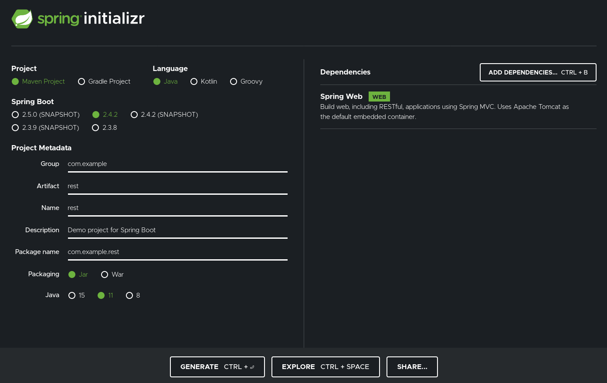
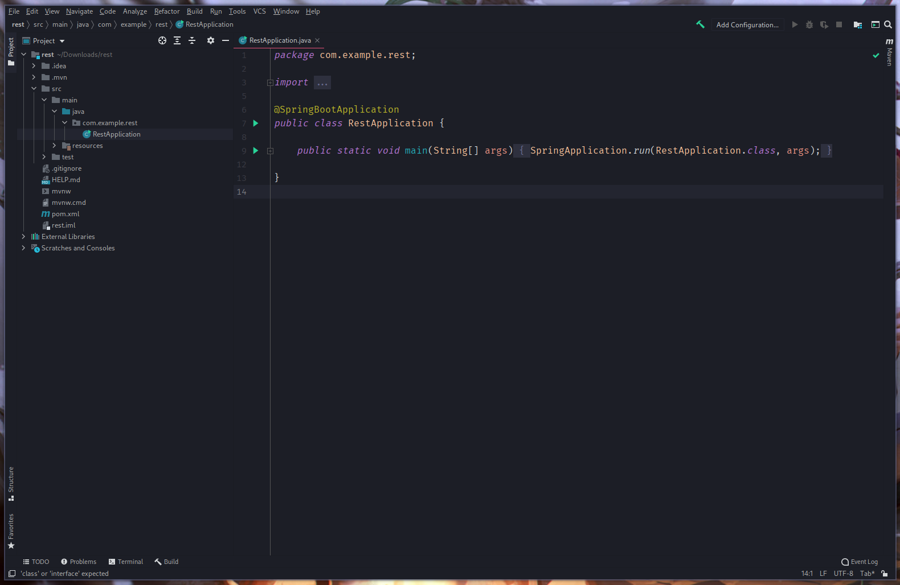
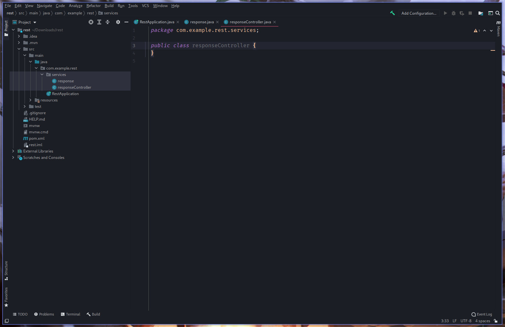
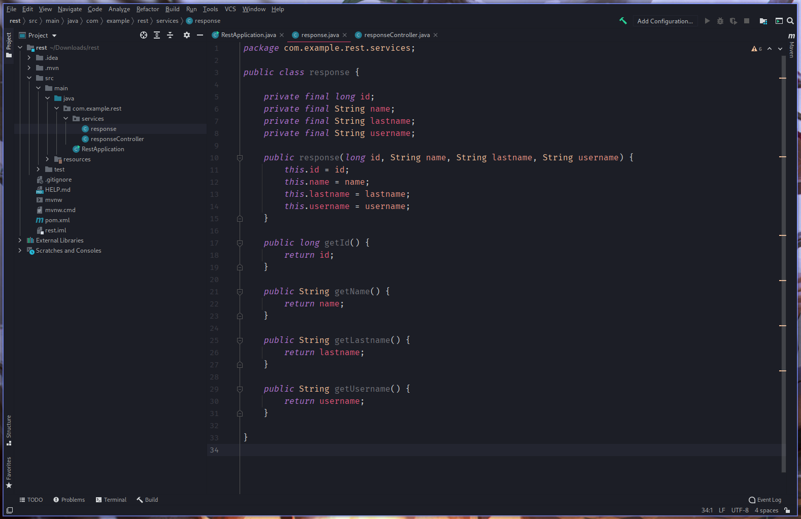
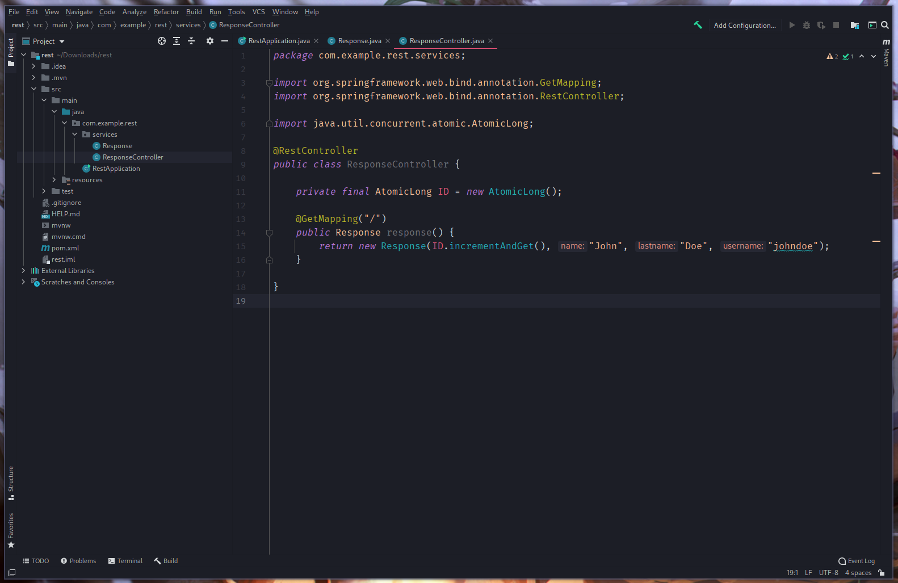
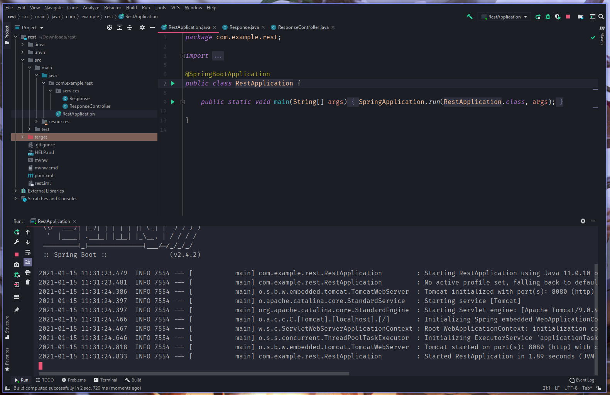
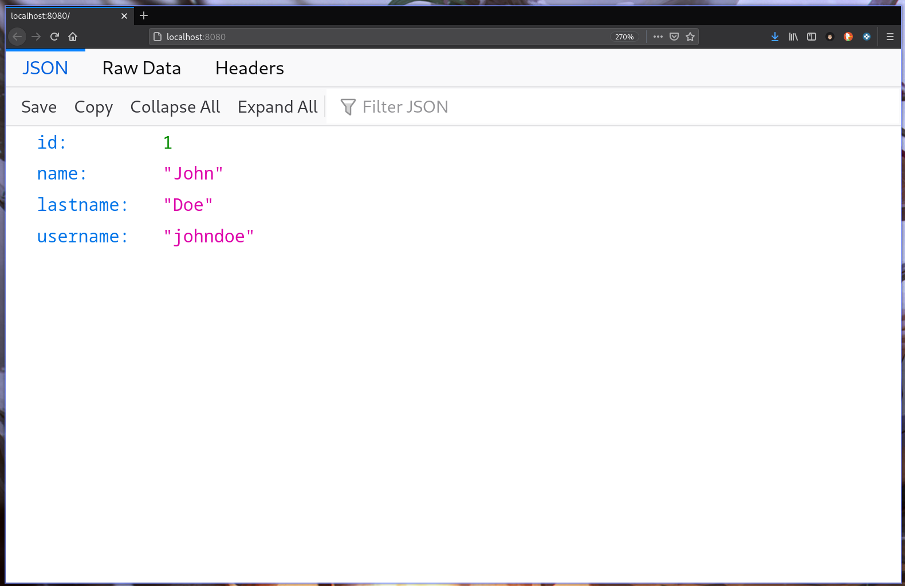

# Spring Boot Starter
Learn how to create a basic REST response using *Java* with *Spring Boot*.

## Pre-requirements
+ Your preferred Java IDE
+ Internet connection
+ Basic Java SE knowledge

## What's Spring?
Essentially [Spring](https://spring.io/why-spring) is a framework for [Inversion of Control (IoC)](https://en.wikipedia.org/wiki/Inversion_of_control), and usually it comes with the use of the pattern of [Dependecy Injection (DI)](https://en.wikipedia.org/wiki/Dependency_injection).

Spring can make our projects development way more easy and fast, and in this short guide we'll see Spring in action while creating some REST responses.

## What's IoC?
In software engineering, **Inversion of Control (IoC)** is a programming principle. It does just like the name says, it *inverts* the flow of control. In the regular flow of the program, the custom code calls the library to resolve generic tasks, but with inversion of control, it is the framework that calls into the custom, or task-specific code.

## What's DI?
[Dependency Injection (DI)](https://www.freecodecamp.org/news/a-quick-intro-to-dependency-injection-what-it-is-and-when-to-use-it-7578c84fa88f/) is an IoC technique in wich an object receives other object that it depends on. These other objects are called dependencies.

## General steps to create the REST example
1. Go to [start.spring.io](https://start.spring.io/) and create a new Spring project with the *Spring Web* dependency.
2. Open the downloaded project in your preferred IDE.
3. Using the next annotations, create the REST example:
   + **@SpringBootApplication:** This annotation is equivalent to using *@Configuration*, *@EnableAutoConfiguration* and *@ComponentScan*
   + **@RestController:** This annotation tells Spring that this code describes an endpoint that should be made available on the web.
   + **@GetMapping("/"):** This annotation tells Spring to use the method below as a response to a GET petition to the `/` route. (There's also *@Post
   Mapping*, *@PutMapping*, *@DeleteMapping*, etc...)
   + **@RequestParam(value="name", defaultValue="unnamed"):** This annotation is telling spring to expect a `name` value in the request.
4. Try the app with `/.mvnw spring-boot:run`, you can build the JAR with `./mvnw clean package`.   

## Step-by-step REST example
1. Go to [start.spring.io](https://start.spring.io) and create a new Spring project with the *Spring Web* dependency.

2. Open the downloaded project in your preferred IDE (In this case we'll use intellij idea). 

See how the downloaded project have a `@SpringBootApplication` annotation, this is straight forward, it tells Spring that the project is a Spring Boot project.

3. Create a new package inside `com.example.rest` named `services/`. Inside the package create two new Java classes `response.java` and a `responseController.java`.

4. Next, create the response class, we'll use an `id`, `name`, `lastname` and `username`. 

> Don't forget to generate the getters, otherwise the response won't work.

5. Now we need to tell Spring how to handle the petitions to this resource.

See how Spring is pretty straight forward, we use the `@RestController` to tell spring this class will be a controller. Also, inside the class we create a method with the annotation `@GetMapping("/")` to tell Spring that function is what needs to be done when a GET petition goes to the `/` route.

This is really all you need to create a simple REST response. It's not hard at all using Spring Boot.

6. We can now test the results, by running the `RestApplication` class and opening your browser in `localhost:8080/`.

